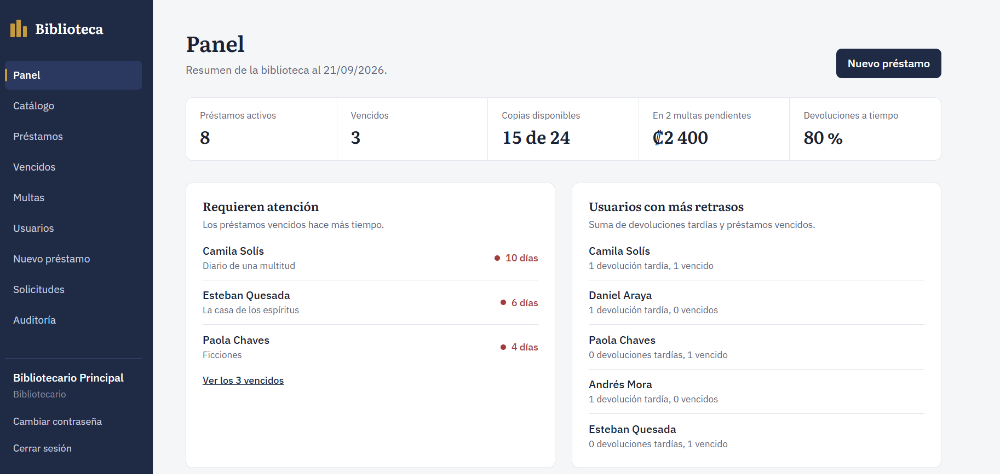
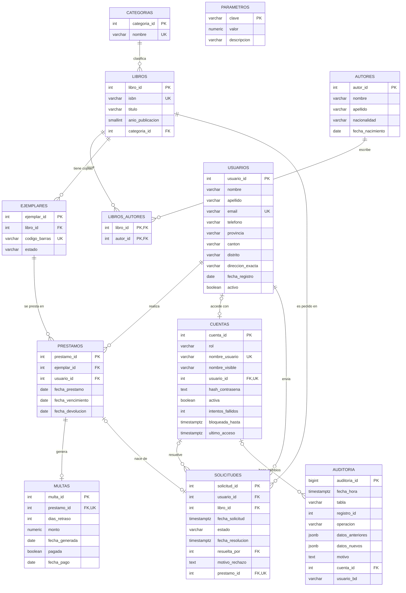
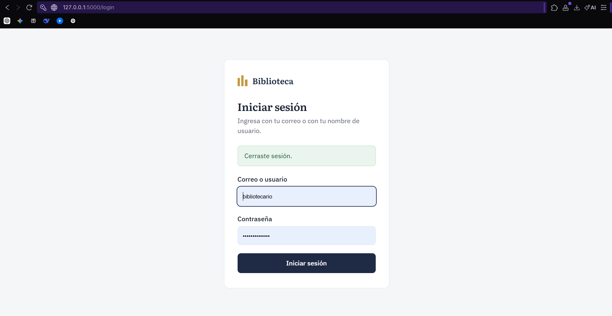
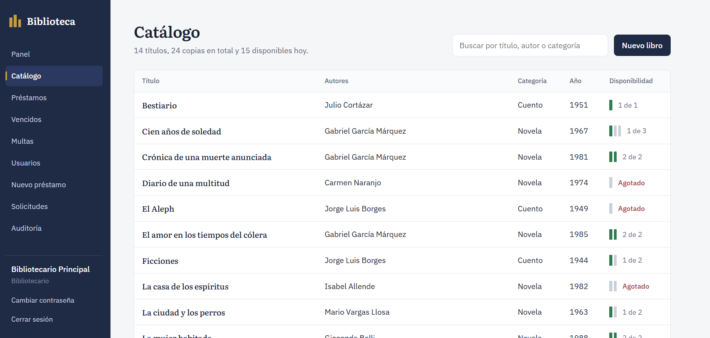
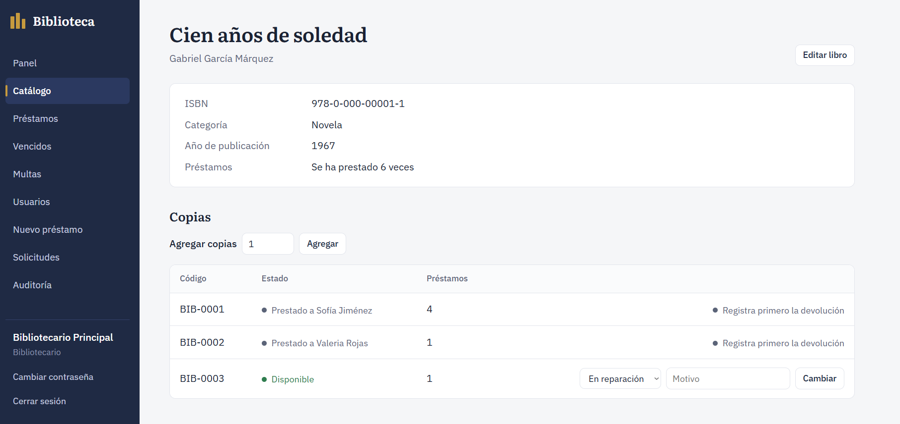
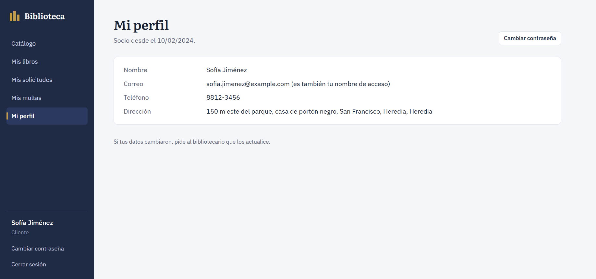
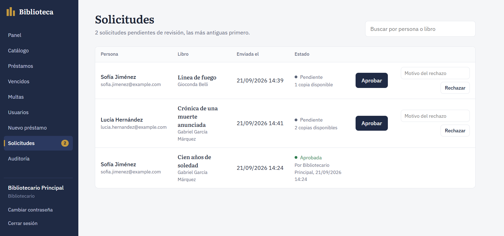
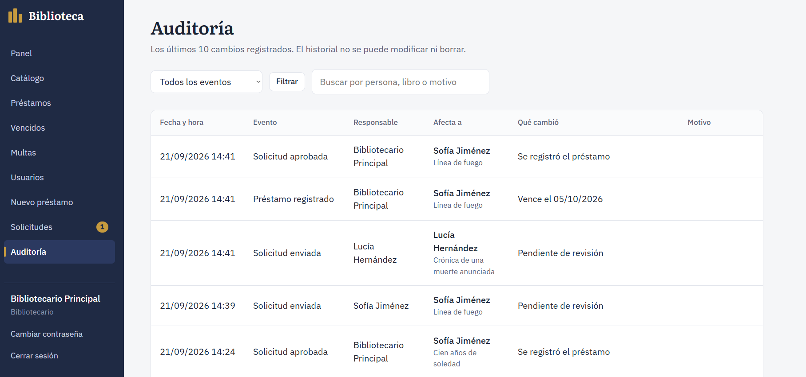
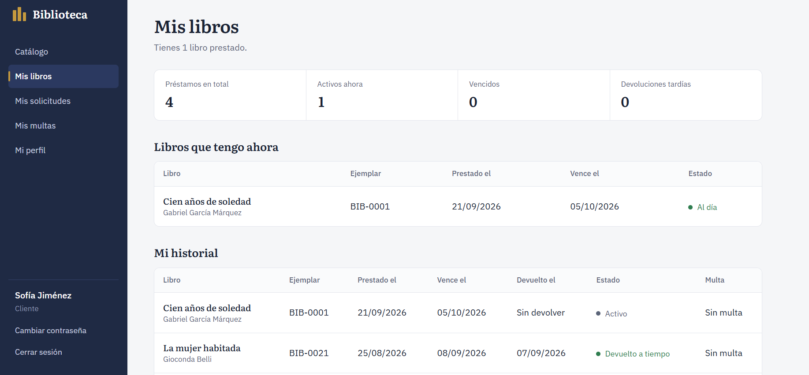

# Sistema de Biblioteca con PostgreSQL

Sistema de gestión de una biblioteca: catálogo, préstamos, multas, usuarios, solicitudes y auditoría. El proyecto pone el foco en la **base de datos**: las reglas de negocio, la seguridad y el historial de cambios viven dentro de PostgreSQL, y una aplicación web hecha con Flask las usa.



## Qué puede hacer

**El bibliotecario**

- Ve un **panel** con cifras, gráficos (préstamos por mes, libros y categorías más usados) y alertas de lo que necesita atención.
- Administra el **catálogo**: libros, autores, categorías, copias físicas y su estado (disponible, en reparación, perdida).
- Registra **préstamos y devoluciones**. Si un libro vuelve tarde, se genera una **multa** automáticamente.
- Administra **usuarios** con su dirección, y ve el perfil de cada uno con los libros que tiene y todo su historial.
- **Aprueba o rechaza** las solicitudes de préstamo de los clientes.
- Corrige errores (a quién se prestó un libro, un pago mal registrado) con un **motivo obligatorio**.
- Consulta la **auditoría**: quién hizo cada cambio, cuándo, qué cambió y por qué.

**El cliente**

- Consulta el catálogo y **solicita** libros.
- Ve solo lo suyo: sus libros prestados, su historial, sus multas y sus solicitudes.

## Lo más destacable de la base de datos

| Tema | Cómo se resuelve |
| --- | --- |
| **Modelado** | 12 tablas normalizadas. Libro y ejemplar están separados (la obra frente a la copia física). |
| **Integridad** | 13 llaves foráneas, 17 restricciones `CHECK` y 22 índices, entre ellos **índices únicos parciales**: una misma copia no puede tener dos préstamos activos, ni una persona dos solicitudes pendientes del mismo libro. |
| **Lógica de negocio en SQL** | 36 funciones PL/pgSQL y 13 triggers. La aplicación solo las llama; las reglas no se pueden saltar. |
| **Automatización** | Un trigger cambia el estado de la copia al prestar o devolver; otro genera la multa cuando el retraso ocurre; la tarifa vive en una tabla de parámetros. |
| **SQL analítico** | Vistas con funciones de ventana (`RANK`, `LAG`, `SUM() OVER`) y `generate_series` para los gráficos del panel. |
| **Contraseñas** | Guardadas con **bcrypt** (`pgcrypto`). Ninguna vista ni pantalla las muestra, ni siquiera al bibliotecario, que solo puede restablecerlas. Bloqueo de la cuenta tras 5 intentos fallidos. |
| **Auditoría** | Un trigger genérico guarda cada cambio como `JSONB` (solo las columnas modificadas). El historial es **inmutable**: otro trigger impide modificarlo, borrarlo o vaciarlo, incluso a un administrador. |
| **Defensa en profundidad** | La base de datos **verifica por su cuenta** quién actúa: un cliente no puede pedir un libro a nombre de otro ni aprobar solicitudes, aunque se saltara la aplicación. |
| **Transacciones y concurrencia** | `SELECT ... FOR UPDATE` al prestar y devolver, y un bloqueo asesor para que dos personas no reciban el mismo código de barras. |

Algunos fragmentos representativos:

```sql
-- Una copia no puede tener dos préstamos activos a la vez
CREATE UNIQUE INDEX uq_prestamo_activo_por_ejemplar
    ON prestamos (ejemplar_id)
    WHERE fecha_devolucion IS NULL;

-- La multa se genera sola, solo cuando un préstamo pasa de "sin devolver" a "devuelto"
CREATE TRIGGER trg_prestamos_generar_multa
AFTER UPDATE OF fecha_devolucion ON prestamos
FOR EACH ROW
WHEN (OLD.fecha_devolucion IS NULL AND NEW.fecha_devolucion IS NOT NULL)
EXECUTE FUNCTION generar_multa();

-- Ranking con empates y variación mensual, sin colapsar las filas
RANK() OVER (ORDER BY COUNT(p.prestamo_id) DESC)                       AS posicion
COUNT(p.prestamo_id) - LAG(COUNT(p.prestamo_id)) OVER (ORDER BY m.mes) AS variacion
```

## Diagrama entidad-relación



## Documentación

- **[Manual de usuario](docs/MANUAL_USUARIO.md):** cómo usar el sistema, tanto como cliente como bibliotecario, con las reglas, los mensajes y las preguntas frecuentes.
- **[Manual técnico](docs/MANUAL_TECNICO.md):** arquitectura, base de datos (vistas, funciones, triggers, índices), rutas de la aplicación, flujos, instalación, mantenimiento y solución de problemas.

## Tecnologías

- **PostgreSQL** (probado con la versión 16) con la extensión `pgcrypto`
- **SQL y PL/pgSQL** para tablas, vistas, funciones y triggers
- **Python 3.10 o superior** y **Flask** para la aplicación web (plantillas Jinja)
- **psycopg 3** como conector entre Python y PostgreSQL
- HTML y CSS propios, sin frameworks ni librerías de gráficos
- **pgAdmin**, **VS Code** y **Git**

## Estructura del repositorio

```
biblioteca-postgresql/
├── app.py                  Aplicación Flask: rutas, permisos y seguridad
├── db.py                   Conexión a PostgreSQL
├── requirements.txt        Dependencias de Python
├── .env.example            Plantilla de configuración
├── sql/                    Scripts de la base de datos, en orden
│   ├── 00_instalar_todo.sql    Instalador para psql
│   ├── 01_schema.sql           Tablas, índices y restricciones
│   ├── 02_datos_prueba_*.sql   Datos de prueba (4 partes)
│   ├── 03_consultas.sql        Consultas de ejemplo
│   ├── 04_vistas.sql           Vistas
│   ├── 05_funciones_triggers.sql   Prestar, devolver y estado de la copia
│   ├── 06_multas.sql           Multas por retraso
│   ├── 07_usuarios.sql         Usuarios: dirección, crear, editar, historial
│   ├── 08_cuentas.sql          Cuentas, roles y contraseñas cifradas
│   ├── 09_auditoria.sql        Auditoría, correcciones y anulación de pagos
│   ├── 10_panel.sql            Vistas analíticas del panel
│   ├── 11_catalogo.sql         Libros, autores, categorías y copias
│   └── 12_solicitudes.sql      Solicitudes de préstamo
├── templates/              Páginas HTML (Jinja)
├── static/                 Estilos y JavaScript
└── docs/
    ├── MANUAL_USUARIO.md   Manual de usuario
    ├── MANUAL_TECNICO.md   Manual técnico
    └── capturas/           Capturas de pantalla
```

Cada script se apoya en los anteriores, y algunos **reemplazan** funciones o vistas de scripts previos (por ejemplo, `09` reemplaza el trigger de estado de `05`). Por eso hay que ejecutarlos siempre en orden.

## Cómo ejecutarlo

Requisitos: PostgreSQL con pgAdmin, Python 3.10 o superior y Git.

**1. Clonar el repositorio y preparar Python**

```
git clone https://github.com/<tu-usuario>/biblioteca-postgresql.git
cd biblioteca-postgresql
python -m venv .venv
.venv\Scripts\activate          # en Mac o Linux: source .venv/bin/activate
pip install -r requirements.txt
```

**2. Crear la base de datos**

En pgAdmin, crea una base llamada `biblioteca`. Después instala todo de una de estas dos formas:

- **Con psql** (desde la carpeta `sql/`):

  ```
  cd sql
  psql -U postgres -d biblioteca -f 00_instalar_todo.sql
  ```

- **Con pgAdmin**: abre el *Query Tool* sobre `biblioteca` y ejecuta los archivos de `sql/` **uno por uno, en orden**, del `01` al `12`. (El `00` no sirve en pgAdmin.)

**3. Configurar la conexión**

Copia `.env.example` como `.env` y completa los valores:

```
DB_HOST=localhost
DB_PORT=5432
DB_NAME=biblioteca
DB_USER=postgres
DB_PASSWORD=tu_contraseña
SECRET_KEY=un_texto_largo_y_aleatorio
```

Para generar la `SECRET_KEY`:

```
python -c "import secrets; print(secrets.token_hex(32))"
```

El archivo `.env` está en el `.gitignore` y nunca se sube al repositorio.

**4. Iniciar la aplicación**

```
python app.py
```

Abre [http://127.0.0.1:5000](http://127.0.0.1:5000).

## Cuentas de demostración

Los scripts crean estas cuentas para poder probar el sistema. **Son solo para demostración**: en un sistema real nunca se escriben contraseñas dentro de un script.

| Rol | Usuario | Contraseña |
| --- | --- | --- |
| Bibliotecario | `bibliotecario` | `Biblioteca2026` |
| Cliente | el correo del usuario, por ejemplo `sofia.jimenez@example.com` | `Cliente2026` |

Todos los usuarios de prueba usan la contraseña `Cliente2026`. Algunos casos interesantes para explorar:

- **Andrés Mora** y **Camila Solís** tienen multas pendientes, así que no pueden pedir libros.
- **Daniel Araya** tiene un libro vencido.
- **Mateo Salas** está inactivo y no puede iniciar sesión.

## Capturas

| | |
| --- | --- |
|  |  |
| Inicio de sesión | Catálogo con la disponibilidad de cada copia |
|  |  |
| Ficha de un libro y sus copias | Perfil de un usuario con su historial |
|  |  |
| Bandeja de solicitudes | Auditoría con responsable y motivo |

**Vista del cliente**



## Decisiones de diseño

- **La lógica vive en la base de datos.** La aplicación no valida reglas de negocio: llama a funciones SQL que las aplican. Así ninguna otra aplicación o acceso directo puede saltárselas.
- **Los usuarios no se borran, se desactivan**, para conservar su historial de préstamos.
- **Las correcciones no editan libremente.** Se hacen con funciones que aplican las mismas reglas que al prestar, exigen un motivo y quedan en el historial.
- **El motivo y la cuenta viajan hasta los triggers** mediante variables de la transacción (`set_config(..., true)`), así un trigger genérico sabe quién y por qué.
- **La tabla de cuentas no se audita con el trigger genérico**, porque copiaría los hashes de las contraseñas al historial.
- **Los cambios automáticos de estado de una copia no se auditan**, para no llenar el historial de ruido; solo los que hace una persona.
- **Las cifras del panel las calculan vistas de SQL**, no Python.

## Limitaciones y mejoras posibles

- Las contraseñas temporales que genera el sistema no obligan a cambiarlas en el primer acceso.
- El plazo de préstamo (14 días) está en la función `prestar_libro`; podría moverse a la tabla `parametros`, como la tarifa de la multa.
- Las solicitudes pendientes no caducan, y una copia no queda apartada mientras se espera la aprobación.
- No hay recuperación de contraseña por correo: el bibliotecario la restablece.
- Faltan pruebas automatizadas. Las reglas de la base de datos se verificaron ejecutando los scripts en PostgreSQL 16 y recorriendo la aplicación de punta a punta.
- El cantón y el distrito son texto libre; podrían validarse contra un catálogo oficial.

## Autor

Proyecto desarrollado por **Alison Salazar Cespedes**.
