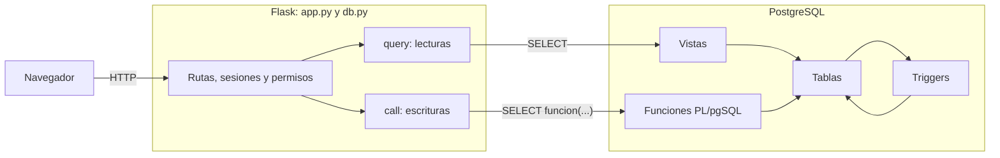
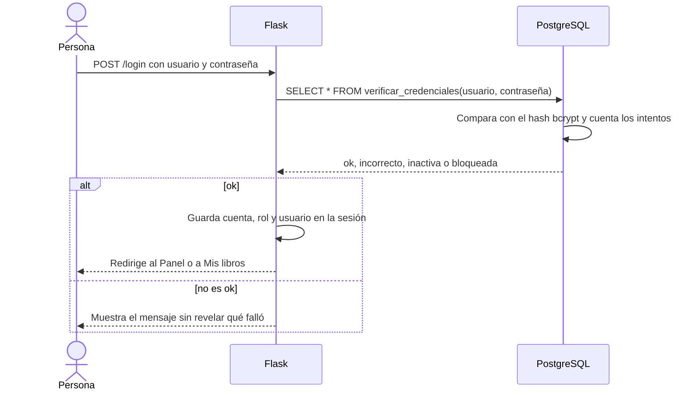
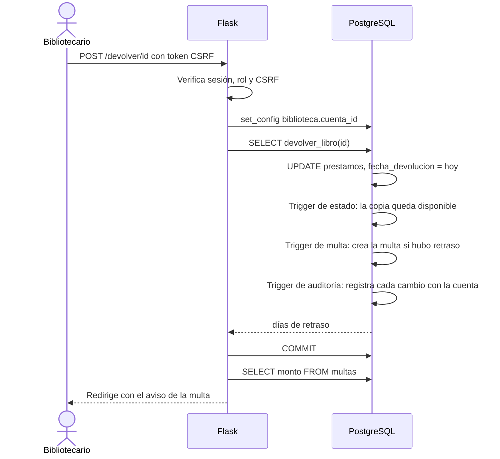
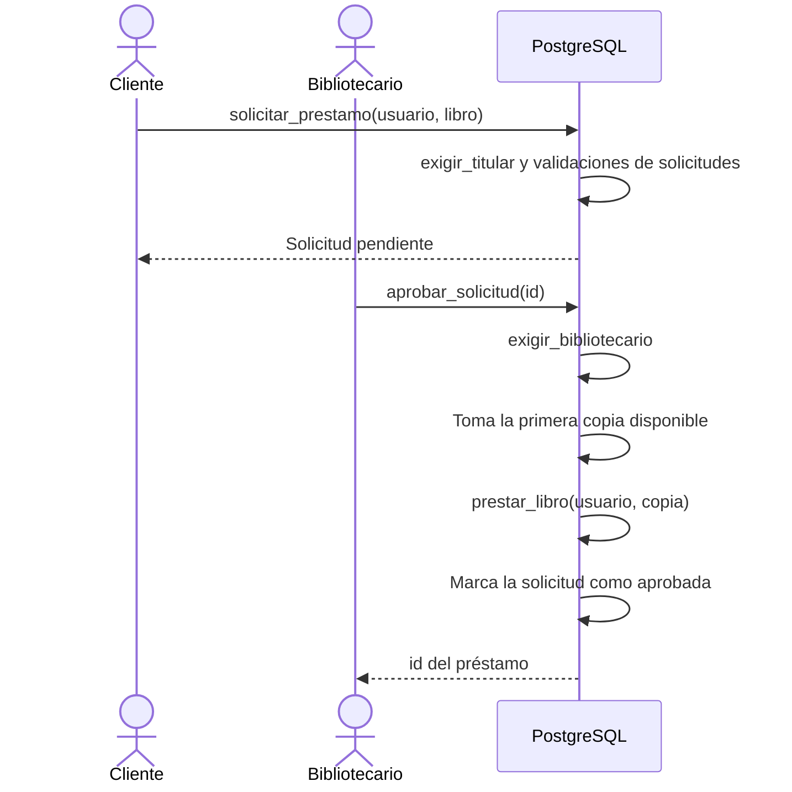

# Manual técnico

Sistema de Biblioteca con PostgreSQL

Este documento describe cómo está construido el sistema, cómo instalarlo y operarlo, y cómo modificarlo. Está pensado para quien va a mantener, revisar o ampliar el proyecto. Para aprender a usar el sistema, ver el [Manual de usuario](MANUAL_USUARIO.md).

Las tablas de vistas, funciones, triggers, índices, restricciones y rutas de este manual **se generaron a partir del sistema en funcionamiento**, no se escribieron a mano, para que coincidan con lo que realmente existe.

## Contenido

1. [Visión general](#1-visión-general)
2. [Arquitectura](#2-arquitectura)
3. [Instalación y configuración](#3-instalación-y-configuración)
4. [Estructura del repositorio](#4-estructura-del-repositorio)
5. [Base de datos](#5-base-de-datos)
6. [Aplicación web](#6-aplicación-web)
7. [Flujos principales](#7-flujos-principales)
8. [Mapa de reglas de negocio](#8-mapa-de-reglas-de-negocio)
9. [Mantenimiento y operación](#9-mantenimiento-y-operación)
10. [Solución de problemas](#10-solución-de-problemas)
11. [Verificación y pruebas](#11-verificación-y-pruebas)
12. [Limitaciones y mejoras posibles](#12-limitaciones-y-mejoras-posibles)
13. [Anexo: convenciones](#13-anexo-convenciones)

---

## 1. Visión general

El sistema gestiona una biblioteca: catálogo, copias físicas, préstamos, multas, usuarios, solicitudes y auditoría. Tiene dos roles, **bibliotecario** y **cliente**.

**Principio de diseño:** las reglas de negocio, la seguridad y el historial viven **dentro de PostgreSQL**. La aplicación web (Flask) es una capa delgada que muestra datos, valida sesiones y permisos, y llama a funciones SQL. Así, ninguna otra aplicación ni un acceso directo a la base puede saltarse las reglas.

| Componente | Tecnología |
| --- | --- |
| Base de datos | PostgreSQL (probado con la versión 16) y la extensión `pgcrypto` |
| Lógica de datos | SQL y PL/pgSQL |
| Aplicación | Python 3.10 o superior, Flask 3 y plantillas Jinja |
| Conector | psycopg 3 |
| Interfaz | HTML y CSS propios, y un archivo de JavaScript |

**Tamaño del proyecto:**

| Elemento | Cantidad |
| --- | --- |
| Tablas | 12 |
| Vistas | 13 |
| Funciones | 36 (32 de negocio y 4 de trigger) |
| Triggers | 13 |
| Restricciones CHECK | 17 |
| Llaves foráneas | 13 |
| Índices (sin contar llaves primarias) | 22 |
| Rutas de la aplicación | 36 |
| Plantillas HTML | 25 |
| Líneas de SQL | 3 244 |
| Líneas de Python | 1 371 |
| Líneas de HTML | 1 767 |
| Líneas de CSS | 1 006 |

---

## 2. Arquitectura



**Cómo se comunican las capas**

- **Lecturas:** la aplicación ejecuta `SELECT` sobre vistas (`query()` en `db.py`). Las cuentas de las cifras y los rankings las hacen las vistas, no Python.
- **Escrituras:** la aplicación nunca hace `INSERT` ni `UPDATE` directos. Siempre llama a una función con `SELECT funcion(...)` (`call()` en `db.py`). Las reglas se aplican dentro de la función y los triggers.
- **Identidad:** al iniciar cada escritura, `call()` guarda la cuenta que actúa en una variable de la transacción (`biblioteca.cuenta_id`). Los triggers de auditoría y las funciones de permisos la leen.
- **Conexiones:** se abre una conexión nueva por operación y se cierra al terminar. Cada operación es una transacción: si algo falla, se deshace todo.

**Capas de seguridad**

| Capa | Qué protege |
| --- | --- |
| Aplicación | Sesión firmada, token CSRF en todo formulario POST, decorador de roles, cookie protegida, páginas sin caché con sesión |
| Funciones SQL | `exigir_bibliotecario` y `exigir_titular` verifican quién actúa, independientemente de la aplicación |
| Tablas | Restricciones `CHECK`, `UNIQUE` (incluidos índices parciales) y llaves foráneas |
| Triggers | Auditoría automática con responsable, y un historial que no se puede alterar |
| Contraseñas | bcrypt con sal, sin exposición en ninguna vista ni en el historial |

---

## 3. Instalación y configuración

### 3.1 Requisitos

- PostgreSQL, con la extensión `pgcrypto` (viene incluida en las instalaciones estándar, dentro del paquete *contrib*). Se probó con la versión 16; no se probaron otras.
- Python 3.10 o superior.
- Git.
- Un usuario de PostgreSQL con permiso para crear extensiones (el script `08_cuentas.sql` ejecuta `CREATE EXTENSION IF NOT EXISTS pgcrypto`). El usuario `postgres` lo tiene.

### 3.2 Pasos

Los pasos detallados están en el [README](../README.md#cómo-ejecutarlo). En resumen:

1. Clonar el repositorio y crear el entorno virtual.
2. Instalar las dependencias con `pip install -r requirements.txt`.
3. Crear una base de datos vacía llamada `biblioteca`.
4. Ejecutar los scripts de `sql/` **en orden** (con `psql -f 00_instalar_todo.sql`, o uno por uno desde pgAdmin).
5. Copiar `.env.example` como `.env` y completarlo.
6. Iniciar con `python app.py`.

### 3.3 Dependencias de Python

| Paquete | Versión mínima | Uso |
| --- | --- | --- |
| Flask | 3.0 | Framework web, sesiones y plantillas |
| psycopg (con `binary`) | 3.1 | Conector a PostgreSQL |
| python-dotenv | 1.0 | Lee las variables del archivo `.env` |

### 3.4 Variables de entorno (`.env`)

| Variable | Valor por defecto | Descripción |
| --- | --- | --- |
| `DB_HOST` | `localhost` | Servidor de PostgreSQL |
| `DB_PORT` | `5432` | Puerto |
| `DB_NAME` | `biblioteca` | Nombre de la base |
| `DB_USER` | `postgres` | Usuario de la base |
| `DB_PASSWORD` | *(ninguno)* | Contraseña del usuario |
| `SECRET_KEY` | `clave-solo-para-desarrollo` | Firma las cookies de sesión. **Debe definirse** con un valor largo y aleatorio |

Para generar una `SECRET_KEY`: `python -c "import secrets; print(secrets.token_hex(32))"`.

El archivo `.env` está en el `.gitignore` y no debe subirse nunca al repositorio.

### 3.5 Verificar la instalación

Con la base recién instalada y los datos de prueba, estas consultas deben devolver:

| Consulta | Resultado esperado |
| --- | --- |
| `SELECT count(*) FROM libros;` | 14 |
| `SELECT count(*) FROM ejemplares;` | 24 |
| `SELECT count(*) FROM usuarios;` | 10 |
| `SELECT count(*) FROM prestamos;` | 20 |
| `SELECT count(*) FROM multas;` | 2 |
| `SELECT count(*) FROM cuentas;` | 11 (1 bibliotecario y 10 clientes) |
| `SELECT * FROM v_panel_resumen;` | 7 préstamos activos, 4 vencidos, 16 de 24 copias disponibles, 2 multas por ₡1 100 y 85 % a tiempo |

Los préstamos de prueba usan fechas **relativas a hoy**, así que siempre hay algunos vencidos sin importar cuándo se instale.

---

## 4. Estructura del repositorio

```
biblioteca-postgresql/
├── app.py                  Aplicación Flask: rutas, permisos y seguridad
├── db.py                   Conexión a PostgreSQL: get_connection, query, call
├── requirements.txt        Dependencias de Python
├── .env.example            Plantilla de configuración
├── .gitignore              Excluye .env, .venv y __pycache__
├── README.md               Presentación del proyecto
├── sql/                    Scripts de la base de datos, en orden (sección 5.2)
├── templates/              Plantillas HTML de Jinja (sección 6.4)
├── static/
│   ├── css/style.css       Estilos de toda la aplicación
│   └── js/buscar.js        Buscador de las tablas
└── docs/
    ├── MANUAL_USUARIO.md   Manual de usuario
    ├── MANUAL_TECNICO.md   Este documento
    └── capturas/           Capturas de pantalla del README y del manual
```

---

## 5. Base de datos

### 5.1 Modelo de datos

El diagrama entidad-relación completo está en el [README](../README.md#diagrama-entidad-relación). Estas son las 12 tablas:

| Tabla | Qué guarda | Restricciones destacadas |
| --- | --- | --- |
| `categorias` | Géneros o clasificaciones | Nombre único |
| `autores` | Nombre, nacionalidad y fecha de nacimiento | |
| `libros` | La obra: ISBN, título, año y categoría | ISBN único (también normalizado); año entre 1000 y 2100 |
| `libros_autores` | Une cada libro con sus autores (N:M) | Llave primaria compuesta; `ON DELETE CASCADE` |
| `ejemplares` | Cada copia física, con código de barras y estado | Código único; estado en `disponible`, `prestado`, `en_reparacion` o `perdido` |
| `usuarios` | Personas registradas, con su dirección de Costa Rica | Correo único sin distinguir mayúsculas; formato de correo, teléfono y provincia |
| `prestamos` | Un ejemplar prestado a un usuario, con sus fechas | Fechas coherentes; **una copia no puede tener dos préstamos activos** |
| `multas` | La multa de un préstamo devuelto tarde | Una por préstamo; pagada y fecha de pago siempre coherentes |
| `parametros` | Valores configurables (la tarifa de la multa) | Valor no negativo |
| `cuentas` | Acceso: rol, hash de la contraseña, intentos y bloqueo | Un cliente siempre ligado a un usuario y un bibliotecario nunca; usuario único |
| `solicitudes` | Pedido de un libro por un cliente, con su resolución | El `CHECK` fija qué datos exige cada estado; una pendiente por persona y libro |
| `auditoria` | Historial de cambios en JSONB | Inmutable por triggers |

**Notas de modelado**

- **Libro y ejemplar están separados:** el libro es la obra y el ejemplar la copia física. Cada préstamo es de un ejemplar concreto.
- **Los usuarios no se borran, se desactivan.** Solo `libros_autores` usa `ON DELETE CASCADE`; ninguna llave hacia `usuarios`, `ejemplares` o `prestamos` lo tiene, así que la base impide borrar a alguien con historial.
- **El cliente entra con el correo de su usuario.** La tabla `cuentas` no repite el correo: para un cliente, `nombre_usuario` es nulo y el acceso se resuelve con `usuarios.email`.
- **Un préstamo sin fecha de devolución es un préstamo activo.** No hay una columna de estado que pueda quedar desincronizada.

### 5.2 Scripts y orden de ejecución

Cada script se apoya en los anteriores y algunos **reemplazan** objetos de scripts previos. Por eso deben ejecutarse **siempre en orden**.

| Script | Contenido | ¿Se puede volver a ejecutar? |
| --- | --- | --- |
| `00_instalar_todo.sql` | Instalador para `psql`: ejecuta todos los demás en orden | Sí, pero **recrea todo desde cero y borra los datos** |
| `01_schema.sql` | Las 7 tablas base, sus índices y restricciones | **Borra todos los datos** (`DROP TABLE` y `CREATE`) |
| `02_datos_prueba_parte1` a `parte4` | Datos ficticios: categorías y autores, libros, ejemplares y usuarios, préstamos | **No.** Duplicaría los datos; hay que recrear la base |
| `03_consultas.sql` | Consultas de ejemplo | Sí, son solo de lectura |
| `04_vistas.sql` | `v_catalogo`, `v_prestamos_activos`, `v_prestamos_vencidos` | Sí |
| `05_funciones_triggers.sql` | `prestar_libro`, `devolver_libro` y el trigger de estado del ejemplar | Sí. Ver la nota sobre reemplazos |
| `06_multas.sql` | Tabla de multas, parámetros, cálculo, trigger, pago y `prestar_libro` v2 | Recrea `multas`: **se pierden los pagos** registrados |
| `07_usuarios.sql` | Dirección, validaciones, crear y editar usuarios, resumen e historial | Sí (es una migración) |
| `08_cuentas.sql` | `pgcrypto`, cuentas, autenticación y las cuentas de demostración | Recrea `cuentas`: se restauran las contraseñas de demostración |
| `09_auditoria.sql` | Auditoría, inmutabilidad, correcciones y anulación de pagos | Recrea `auditoria`: **se pierde el historial** |
| `10_panel.sql` | Vistas analíticas del panel | Sí |
| `11_catalogo.sql` | Autores, categorías, libros, copias y su auditoría | Sí |
| `12_solicitudes.sql` | Solicitudes, verificación de identidad y su auditoría | Recrea `solicitudes` |

**Objetos que un script posterior reemplaza**

| Objeto | Versiones |
| --- | --- |
| `prestar_libro` | `05` (original) → `06` (agrega la regla de multas pendientes) |
| `actualizar_estado_ejemplar` y su trigger | `05` (original) → `09` (agrega el cambio de copia en una corrección) |
| `v_auditoria` | `09` → `11` (eventos del catálogo) → `12` (eventos de solicitudes) |

Si vuelves a ejecutar un script antiguo, su versión reemplaza a la más nueva. En ese caso, **vuelve a ejecutar los posteriores**. Lo mismo aplica si recreas `cuentas` (`08`): la auditoría y las solicitudes tienen llaves foráneas hacia ella, así que conviene volver a ejecutar `09` a `12`.

### 5.3 Vistas

| Vista | Script | Qué hace |
| --- | --- | --- |
| `v_catalogo` | 04 | Cada libro con sus autores, su categoría y cuántas copias tiene en total y disponibles. |
| `v_prestamos_activos` | 04 | Préstamos sin devolver, con el usuario, el libro y los días de retraso (0 si aún no vencen). |
| `v_prestamos_vencidos` | 04 | Los préstamos activos que ya pasaron su fecha. Se construye sobre la vista anterior. |
| `v_multas` | 06 | Multas con el usuario y el libro ya unidos. |
| `v_historial_usuario` | 07 | Todos los préstamos de cada usuario, con libro, autores, estado, días de retraso y multa. |
| `v_usuarios_resumen` | 07 | Cada usuario con su dirección completa y sus estadísticas: préstamos totales, activos, vencidos, devoluciones tardías y multas. |
| `v_cuentas` | 08 | Las cuentas de acceso **sin el hash** de la contraseña. Es la única forma en que la aplicación las lista. |
| `v_auditoria` | 09, 11, 12 | El historial listo para mostrar: evento legible, responsable, y los ids resueltos a nombres. Cada script posterior la reemplaza con más eventos. |
| `v_panel_resumen` | 10 | Una sola fila con las cifras principales del panel. |
| `v_prestamos_por_mes` | 10 | Préstamos de los últimos 12 meses sin huecos (`generate_series`) y variación contra el mes anterior (`LAG`). |
| `v_ranking_libros` | 10 | Veces que se prestó cada libro y su posición, con empates (`RANK`). |
| `v_uso_categorias` | 10 | Préstamos por categoría y su porcentaje del total (`SUM() OVER ()`). |
| `v_solicitudes` | 12 | Las solicitudes con la persona, el libro, quién las resolvió y cuántas copias disponibles tiene hoy el libro. |

Las vistas concentran los cálculos para que la aplicación solo lea. Las de `10_panel.sql` usan **funciones de ventana**, que calculan sobre un conjunto de filas sin colapsarlas como haría un `GROUP BY`.

### 5.4 Funciones

Hay 36 funciones. Todas están escritas en PL/pgSQL, salvo `calcular_multa`, que es SQL.

| Función | Devuelve | Script | Qué hace |
| --- | --- | --- | --- |
| `actualizar_estado_ejemplar()` | trigger | 05, 09 | Trigger: marca la copia como prestada o disponible al abrir o cerrar un préstamo, o al corregir su copia. |
| `devolver_libro(p_prestamo_id integer)` | integer | 05 | Marca el préstamo como devuelto hoy y devuelve los días de retraso. |
| `prestar_libro(p_usuario_id integer, p_ejemplar_id integer, p_dias integer)` | integer | 05, 06 | Registra un préstamo (14 días por defecto). Valida usuario activo, sin multas y copia disponible. |
| `calcular_multa(p_dias_retraso integer)` | numeric | 06 | Devuelve el monto de la multa según los días y la tarifa guardada en `parametros`. |
| `generar_multa()` | trigger | 06 | Trigger: crea la multa de un préstamo que se devolvió con retraso. |
| `pagar_multa(p_multa_id integer)` | numeric | 06 | Marca la multa como pagada hoy y devuelve el monto. |
| `crear_usuario(p_nombre text, p_apellido text, p_email text, p_telefono text, p_provincia text, p_canton text, p_distrito text, p_direccion text)` | integer | 07 | Registra un usuario con sus datos normalizados y validados. |
| `editar_usuario(p_usuario_id integer, p_nombre text, p_apellido text, p_email text, p_telefono text, p_provincia text, p_canton text, p_distrito text, p_direccion text, p_activo boolean)` | void | 07 | Edita un usuario. No permite desactivar a quien tiene préstamos activos. |
| `normalizar_telefono(p_telefono text)` | text | 07 | Deja el teléfono como 8812-3456, o falla si no tiene 8 dígitos. |
| `validar_datos_usuario(p_nombre text, p_apellido text, p_email text, p_provincia text)` | void | 07 | Validaciones compartidas por crear y editar usuarios (nombre, correo y provincia). |
| `cambiar_contrasena(p_cuenta_id integer, p_actual text, p_nueva text)` | void | 08 | La persona cambia su propia contraseña, verificando la actual. |
| `crear_cuenta_bibliotecario(p_nombre_usuario text, p_nombre_visible text, p_contrasena text)` | integer | 08 | Crea una cuenta de bibliotecario con su nombre de usuario, su nombre visible y su contraseña cifrada. |
| `crear_cuenta_cliente(p_usuario_id integer, p_contrasena text)` | integer | 08 | Le da acceso al sistema a un usuario que ya existe. |
| `crear_usuario_con_cuenta(p_nombre text, p_apellido text, p_email text, p_contrasena text, p_telefono text, p_provincia text, p_canton text, p_distrito text, p_direccion text)` | integer | 08 | Crea el usuario y su cuenta en una sola transacción. |
| `restablecer_contrasena(p_cuenta_id integer, p_nueva text)` | void | 08 | Reemplaza la contraseña de una cuenta y la desbloquea. Nadie ve la anterior. |
| `validar_contrasena(p_contrasena text)` | void | 08 | Exige mínimo 8 caracteres, con letras y números. |
| `verificar_credenciales(p_identificador text, p_contrasena text)` | tabla (resultado, cuenta, rol, usuario, nombre, minutos) | 08 | El inicio de sesión: compara con bcrypt, cuenta los intentos y bloquea. Devuelve un resultado, no lanza errores. |
| `anular_pago_multa(p_multa_id integer, p_motivo text)` | void | 09 | Deja pendiente una multa que se marcó como pagada por error. Exige motivo. |
| `bloquear_cambios_auditoria()` | trigger | 09 | Trigger: lanza un error ante cualquier UPDATE, DELETE o TRUNCATE sobre la auditoría. |
| `corregir_prestamo(p_prestamo_id integer, p_usuario_id integer, p_ejemplar_id integer, p_motivo text)` | void | 09 | Cambia el usuario o el ejemplar de un préstamo activo, con las mismas reglas que al prestar. Exige motivo. |
| `registrar_auditoria()` | trigger | 09 | Trigger genérico: guarda cada cambio como JSONB con la cuenta, el motivo y solo las columnas modificadas. |
| `agregar_ejemplares(p_libro_id integer, p_cantidad integer)` | integer | 11 | Agrega copias con códigos BIB-#### consecutivos, con un bloqueo asesor para evitar códigos repetidos. |
| `auditar_manual(p_tabla text, p_registro_id integer, p_operacion text, p_anteriores jsonb, p_nuevos jsonb)` | void | 11 | Inserta un registro de auditoría a mano, para cambios que un trigger de una sola tabla no ve (los autores de un libro). |
| `cambiar_estado_ejemplar(p_ejemplar_id integer, p_estado text, p_motivo text)` | void | 11 | Cambia una copia a disponible, en reparación o perdida. Exige motivo y no toca copias prestadas. |
| `crear_autor(p_nombre text, p_apellido text, p_nacionalidad text, p_fecha_nacimiento date)` | integer | 11 | Crea un autor, sin duplicar nombre y apellido. |
| `crear_categoria(p_nombre text)` | integer | 11 | Crea una categoría, sin repetir nombres. |
| `crear_libro(p_isbn text, p_titulo text, p_anio integer, p_categoria_id integer, p_autores integer[], p_copias integer)` | integer | 11 | Crea el libro, lo une a sus autores y agrega sus copias iniciales, todo en una transacción. |
| `editar_libro(p_libro_id integer, p_isbn text, p_titulo text, p_anio integer, p_categoria_id integer, p_autores integer[])` | void | 11 | Edita un libro y sus autores, anotando el cambio de autores en la auditoría. |
| `validar_datos_libro(p_isbn text, p_titulo text, p_anio integer, p_categoria_id integer, p_autores integer[])` | void | 11 | Validaciones compartidas por crear y editar libros (ISBN, título, año, categoría y autores). |
| `aprobar_solicitud(p_solicitud_id integer)` | integer | 12 | Solo bibliotecario. Toma la primera copia disponible, llama a `prestar_libro` y marca la solicitud como aprobada. |
| `cancelar_solicitud(p_solicitud_id integer, p_usuario_id integer)` | void | 12 | El cliente cancela su propia solicitud mientras siga pendiente. |
| `cuenta_actual()` | integer | 12 | Devuelve la cuenta que actúa, según la variable `biblioteca.cuenta_id`, o NULL si no hay. |
| `exigir_bibliotecario()` | void | 12 | Lanza un error si la cuenta que actúa no es de un bibliotecario. |
| `exigir_titular(p_usuario_id integer)` | void | 12 | Lanza un error si la cuenta que actúa no es la del usuario indicado. |
| `rechazar_solicitud(p_solicitud_id integer, p_motivo text)` | void | 12 | Solo bibliotecario. Rechaza una solicitud pendiente con un motivo obligatorio. |
| `solicitar_prestamo(p_usuario_id integer, p_libro_id integer)` | integer | 12 | El cliente solicita un libro. Valida las reglas de solicitudes y su identidad. |

**Patrones que se repiten**

- **`validar_*` compartidas:** crear y editar usan las mismas validaciones (`validar_datos_usuario`, `validar_datos_libro`, `validar_contrasena`), para no duplicar reglas.
- **Errores con `RAISE EXCEPTION`:** los mensajes están escritos para mostrarse tal cual al usuario. La aplicación los captura y los muestra como avisos.
- **`FOR UPDATE`:** las funciones que leen y luego modifican una fila la bloquean primero (préstamos, multas, cuentas, ejemplares, solicitudes).
- **`verificar_credenciales` no lanza errores:** devuelve un resultado (`ok`, `incorrecto`, `inactiva` o `bloqueada`). Un error deshace la transacción y con ella se perdería el conteo de intentos fallidos.

### 5.5 Triggers

| Trigger | Tabla | Momento y evento | Nivel | Qué hace |
| --- | --- | --- | --- | --- |
| `trg_auditoria_inmutable` | `auditoria` | BEFORE DELETE, UPDATE | por fila | Impide modificar o borrar filas de la auditoría. |
| `trg_auditoria_sin_truncate` | `auditoria` | BEFORE TRUNCATE | por sentencia | Impide vaciar la tabla de auditoría. |
| `trg_auditoria_autores` | `autores` | AFTER INSERT, DELETE, UPDATE | por fila | Audita altas, cambios y bajas de autores. |
| `trg_auditoria_categorias` | `categorias` | AFTER INSERT, DELETE, UPDATE | por fila | Audita altas, cambios y bajas de categorías. |
| `trg_auditoria_ejemplares_alta` | `ejemplares` | AFTER INSERT, DELETE | por fila | Audita las altas y bajas de copias. |
| `trg_auditoria_ejemplares_estado` | `ejemplares` | AFTER UPDATE | por fila | Audita los cambios de estado de una copia, solo cuando los hace una persona (`biblioteca.cambio_manual = 'si'`). |
| `trg_auditoria_libros` | `libros` | AFTER INSERT, DELETE, UPDATE | por fila | Audita altas, cambios y bajas de libros. |
| `trg_auditoria_multas` | `multas` | AFTER INSERT, DELETE, UPDATE | por fila | Audita la generación, el pago y la anulación de multas. |
| `trg_auditoria_prestamos` | `prestamos` | AFTER INSERT, DELETE, UPDATE | por fila | Audita préstamos, devoluciones y correcciones. |
| `trg_prestamos_estado_ejemplar` | `prestamos` | AFTER INSERT, UPDATE OF fecha_devolucion, ejemplar_id | por fila | Marca la copia como prestada o disponible al abrir o cerrar un préstamo, o al cambiar su copia. |
| `trg_prestamos_generar_multa` | `prestamos` | AFTER UPDATE OF fecha_devolucion | por fila | Crea la multa cuando un préstamo pasa de sin devolver a devuelto con retraso (cláusula `WHEN`). |
| `trg_auditoria_solicitudes` | `solicitudes` | AFTER INSERT, DELETE, UPDATE | por fila | Audita solicitudes enviadas, aprobadas, rechazadas y canceladas. |
| `trg_auditoria_usuarios` | `usuarios` | AFTER INSERT, DELETE, UPDATE | por fila | Audita altas, ediciones y desactivaciones de usuarios. |

Detalles importantes:

- **`trg_prestamos_generar_multa`** usa una cláusula `WHEN`, así que solo se ejecuta cuando el préstamo pasa de sin devolver a devuelto.
- **`trg_auditoria_ejemplares_estado`** solo se dispara cuando la variable `biblioteca.cambio_manual` vale `'si'`. Así los cambios automáticos de prestado y disponible no llenan el historial.
- **Orden de los triggers de `prestamos`:** PostgreSQL ejecuta los triggers del mismo evento en orden alfabético por nombre: primero `trg_auditoria_prestamos`, luego `trg_prestamos_estado_ejemplar` y por último `trg_prestamos_generar_multa`.
- **La tabla `cuentas` no tiene trigger de auditoría**, a propósito: copiaría los hashes de las contraseñas al historial.

### 5.6 Índices y restricciones

**Índices** (sin contar las llaves primarias):

| Tabla | Índice | Para qué |
| --- | --- | --- |
| `auditoria` | `idx_auditoria_cuenta` | Buscar los cambios que hizo una cuenta. |
| `auditoria` | `idx_auditoria_fecha` | Listar el historial de lo más reciente a lo más antiguo. |
| `auditoria` | `idx_auditoria_registro` | Buscar el historial de un registro concreto (tabla e id). |
| `categorias` | `categorias_nombre_key` | Restricción UNIQUE. |
| `cuentas` | `cuentas_usuario_id_key` | Restricción UNIQUE. |
| `cuentas` | `uq_cuentas_nombre_usuario` | Parcial: el nombre de usuario de un bibliotecario no se repite, sin importar las mayúsculas. |
| `ejemplares` | `ejemplares_codigo_barras_key` | Restricción UNIQUE. |
| `ejemplares` | `idx_ejemplares_libro` | Acelera los JOIN por la llave foránea. |
| `libros` | `idx_libros_categoria` | Acelera los JOIN por la llave foránea. |
| `libros` | `libros_isbn_key` | Restricción UNIQUE. |
| `libros` | `uq_libros_isbn_normalizado` | El ISBN no se repite aunque se escriba con o sin guiones. |
| `libros_autores` | `idx_libros_autores_autor` | Acelera los JOIN por la llave foránea. |
| `multas` | `idx_multas_pendientes` | Parcial: indexa solo las multas pendientes, que son las más consultadas. |
| `multas` | `multas_prestamo_id_key` | Restricción UNIQUE. |
| `prestamos` | `idx_prestamos_usuario` | Acelera los JOIN por la llave foránea. |
| `prestamos` | `uq_prestamo_activo_por_ejemplar` | Parcial: una copia no puede tener dos préstamos activos a la vez. |
| `solicitudes` | `idx_solicitudes_pendientes` | Parcial: solicitudes pendientes por fecha (la bandeja del bibliotecario). |
| `solicitudes` | `idx_solicitudes_usuario` | Acelera los JOIN por la llave foránea. |
| `solicitudes` | `solicitudes_prestamo_id_key` | Restricción UNIQUE. |
| `solicitudes` | `uq_solicitud_pendiente` | Parcial: una persona no puede tener dos solicitudes pendientes del mismo libro. |
| `usuarios` | `uq_usuarios_email_minuscula` | El correo no se repite sin importar las mayúsculas. |
| `usuarios` | `usuarios_email_key` | Restricción UNIQUE. |

Los **índices únicos parciales** (`WHERE ...`) son la herramienta que hace cumplir varias reglas de negocio directamente en la base, como que una copia no pueda tener dos préstamos activos.

**Restricciones `CHECK`** (17):

| Tabla | Restricción | Definición |
| --- | --- | --- |
| `auditoria` | `auditoria_operacion_check` | `CHECK (((operacion)::text = ANY ((ARRAY['INSERT'::character varying, 'UPDATE'::character varying, 'DELETE'::character varying])::text[])))` |
| `cuentas` | `cuentas_check` | `CHECK (((((rol)::text = 'cliente'::text) AND (usuario_id IS NOT NULL) AND (nombre_usuario IS NULL)) OR (((rol)::text = 'bibliotecario'::text) AND (usuario_id IS NULL) AND (nombre_usuario IS NOT NULL) AND (nombre_visible IS NOT NULL))))` |
| `cuentas` | `cuentas_nombre_usuario_check` | `CHECK (((nombre_usuario IS NULL) OR ((nombre_usuario)::text ~ '^[A-Za-z0-9._-]{3,50}$'::text)))` |
| `cuentas` | `cuentas_rol_check` | `CHECK (((rol)::text = ANY ((ARRAY['bibliotecario'::character varying, 'cliente'::character varying])::text[])))` |
| `ejemplares` | `ejemplares_estado_check` | `CHECK (((estado)::text = ANY ((ARRAY['disponible'::character varying, 'prestado'::character varying, 'en_reparacion'::character varying, 'perdido'::character varying])::text[])))` |
| `libros` | `libros_anio_publicacion_check` | `CHECK (((anio_publicacion >= 1000) AND (anio_publicacion <= 2100)))` |
| `multas` | `multas_check` | `CHECK (((pagada AND (fecha_pago IS NOT NULL)) OR ((NOT pagada) AND (fecha_pago IS NULL))))` |
| `multas` | `multas_dias_retraso_check` | `CHECK ((dias_retraso > 0))` |
| `multas` | `multas_monto_check` | `CHECK ((monto >= (0)::numeric))` |
| `parametros` | `parametros_valor_check` | `CHECK ((valor >= (0)::numeric))` |
| `prestamos` | `prestamos_check` | `CHECK ((fecha_vencimiento >= fecha_prestamo))` |
| `prestamos` | `prestamos_check1` | `CHECK (((fecha_devolucion IS NULL) OR (fecha_devolucion >= fecha_prestamo)))` |
| `solicitudes` | `solicitudes_check` | `CHECK (((((estado)::text = 'pendiente'::text) AND (fecha_resolucion IS NULL) AND (prestamo_id IS NULL)) OR (((estado)::text = 'aprobada'::text) AND (fecha_resolucion IS NOT NULL) AND (prestamo_id IS NOT NULL)) OR (((estado)::text = 'rechazada'::text) AND (fecha_resolucion IS NOT NULL) AND (prestamo_id IS NULL) AND (motivo_rechazo IS NOT NULL)) OR (((estado)::text = 'cancelada'::text) AND (fecha_resolucion IS NOT NULL) AND (prestamo_id IS NULL))))` |
| `solicitudes` | `solicitudes_estado_check` | `CHECK (((estado)::text = ANY ((ARRAY['pendiente'::character varying, 'aprobada'::character varying, 'rechazada'::character varying, 'cancelada'::character varying])::text[])))` |
| `usuarios` | `ck_usuarios_email_formato` | `CHECK (((email)::text ~ '^[^@[:space:]]+@[^@[:space:]]+\.[^@[:space:]]+$'::text))` |
| `usuarios` | `ck_usuarios_provincia` | `CHECK (((provincia)::text = ANY ((ARRAY['San José'::character varying, 'Alajuela'::character varying, 'Cartago'::character varying, 'Heredia'::character varying, 'Guanacaste'::character varying, 'Puntarenas'::character varying, 'Limón'::character varying])::text[])))` |
| `usuarios` | `ck_usuarios_telefono_formato` | `CHECK (((telefono IS NULL) OR ((telefono)::text ~ '^[0-9]{4}-[0-9]{4}$'::text)))` |

**Llaves foráneas** (13):

| Tabla | Llave foránea |
| --- | --- |
| `auditoria` | `FOREIGN KEY (cuenta_id) REFERENCES cuentas(cuenta_id)` |
| `cuentas` | `FOREIGN KEY (usuario_id) REFERENCES usuarios(usuario_id)` |
| `ejemplares` | `FOREIGN KEY (libro_id) REFERENCES libros(libro_id)` |
| `libros` | `FOREIGN KEY (categoria_id) REFERENCES categorias(categoria_id)` |
| `libros_autores` | `FOREIGN KEY (autor_id) REFERENCES autores(autor_id) ON DELETE CASCADE` |
| `libros_autores` | `FOREIGN KEY (libro_id) REFERENCES libros(libro_id) ON DELETE CASCADE` |
| `multas` | `FOREIGN KEY (prestamo_id) REFERENCES prestamos(prestamo_id)` |
| `prestamos` | `FOREIGN KEY (ejemplar_id) REFERENCES ejemplares(ejemplar_id)` |
| `prestamos` | `FOREIGN KEY (usuario_id) REFERENCES usuarios(usuario_id)` |
| `solicitudes` | `FOREIGN KEY (libro_id) REFERENCES libros(libro_id)` |
| `solicitudes` | `FOREIGN KEY (prestamo_id) REFERENCES prestamos(prestamo_id)` |
| `solicitudes` | `FOREIGN KEY (resuelta_por) REFERENCES cuentas(cuenta_id)` |
| `solicitudes` | `FOREIGN KEY (usuario_id) REFERENCES usuarios(usuario_id)` |

### 5.7 Variables de la transacción

Tres datos viajan mediante variables que solo viven durante la transacción actual. Se fijan con `set_config(nombre, valor, true)` y se leen con `current_setting(nombre, true)`, que devuelve `NULL` si no existe.

| Variable | La fija | La leen | Para qué |
| --- | --- | --- | --- |
| `biblioteca.cuenta_id` | `call()` en `db.py`, al inicio de cada escritura | `registrar_auditoria`, `auditar_manual`, `cuenta_actual` (y con ella `exigir_bibliotecario`, `exigir_titular`, `aprobar_solicitud`, `rechazar_solicitud`, `cancelar_solicitud`) | Saber quién hace el cambio |
| `biblioteca.motivo` | `corregir_prestamo`, `anular_pago_multa`, `cambiar_estado_ejemplar`, `rechazar_solicitud` | `registrar_auditoria`, `auditar_manual` | El motivo que queda en la auditoría |
| `biblioteca.cambio_manual` | `cambiar_estado_ejemplar` | La cláusula `WHEN` de `trg_auditoria_ejemplares_estado` | Distinguir un cambio de estado hecho por una persona del automático |

Como al terminar la transacción un valor local puede quedar vacío en lugar de nulo, el código siempre lo lee con `NULLIF(current_setting(...), '')`.

Si no hay `cuenta_id` (por ejemplo, alguien trabajando directamente en pgAdmin), la auditoría registra el cambio con el responsable *"Acceso directo a la base de datos"*, y las funciones `exigir_*` **permiten** la acción, porque se asume que es un administrador de la base. Si el `cuenta_id` corresponde a una cuenta que ya no existe (una sesión vieja), se trata igual que si no hubiera.

### 5.8 Auditoría

La tabla `auditoria` guarda una fila por cada cambio en las tablas vigiladas: `prestamos`, `multas`, `usuarios`, `libros`, `autores`, `categorias`, `ejemplares` y `solicitudes`.

| Columna | Contenido |
| --- | --- |
| `fecha_hora` | Cuándo (`timestamptz`) |
| `tabla` y `registro_id` | Qué registro cambió |
| `operacion` | `INSERT`, `UPDATE` o `DELETE` |
| `datos_anteriores` y `datos_nuevos` | Los valores en JSONB. En un `UPDATE` **solo se guardan las columnas que cambiaron** |
| `motivo` | Si el cambio lo pidió (correcciones, rechazos, cambios de estado) |
| `cuenta_id` | La cuenta responsable, o nulo |
| `usuario_bd` | El rol de PostgreSQL que ejecutó el cambio |

**Un solo trigger genérico** (`registrar_auditoria`) sirve para todas las tablas. Recibe como argumento el nombre de la llave primaria y usa `to_jsonb(NEW)` y `to_jsonb(OLD)` para trabajar sin conocer las columnas.

**Inmutabilidad:** dos triggers (`bloquear_cambios_auditoria`) impiden `UPDATE`, `DELETE` y `TRUNCATE`, incluso a un superusuario. La única forma de eliminar el historial es borrar la tabla o la base de datos completa.

**Cambios que el trigger no ve:** los autores de un libro viven en `libros_autores`, así que `editar_libro` los anota a mano con `auditar_manual`.

**Consultas útiles**

```sql
-- Los últimos 20 eventos
SELECT fecha_hora, evento, responsable, usuario, libro, motivo
FROM v_auditoria
ORDER BY auditoria_id DESC
LIMIT 20;

-- Todo lo que hizo una cuenta
SELECT fecha_hora, evento, usuario, libro
FROM v_auditoria
WHERE responsable = 'Bibliotecario Principal'
ORDER BY auditoria_id DESC;

-- La historia completa de un préstamo (reemplaza 12 por su id)
SELECT auditoria_id, fecha_hora, operacion, datos_anteriores, datos_nuevos, motivo
FROM auditoria
WHERE tabla = 'prestamos' AND registro_id = 12
ORDER BY auditoria_id;
```

### 5.9 Seguridad en la base de datos

- **Contraseñas:** se guardan con bcrypt (`crypt(contraseña, gen_salt('bf', 10))`), con una sal distinta por cuenta. Nunca se guarda la contraseña en claro. Para verificar, `crypt(intento, hash)` repite el cifrado usando el propio hash como sal y se compara.
- **El hash no sale de la base:** la vista `v_cuentas` no lo incluye, `verificar_credenciales` no lo devuelve, y la tabla `cuentas` no se audita.
- **Política de contraseñas:** mínimo 8 caracteres, con letras y números (`validar_contrasena`).
- **Bloqueo:** al 5.º intento fallido, la cuenta se bloquea 15 minutos (`bloqueada_hasta`). Un restablecimiento de contraseña la desbloquea.
- **Mensaje genérico:** cuando el usuario no existe o la contraseña no coincide, el resultado es el mismo (`incorrecto`).
- **Verificación de identidad:** `exigir_titular(usuario)` impide actuar a nombre de otra persona y `exigir_bibliotecario()` impide que un cliente apruebe solicitudes, aunque alguien llamara a las funciones sin pasar por la aplicación.

### 5.10 Concurrencia e integridad

- **`SELECT ... FOR UPDATE`** bloquea la fila mientras se valida y modifica, para que dos operaciones simultáneas no se pisen. Por ejemplo, dos bibliotecarios no pueden prestar la misma copia a la vez.
- **Bloqueo asesor** (`pg_advisory_xact_lock`) en `agregar_ejemplares`, para que dos personas que agregan copias al mismo tiempo no reciban el mismo código de barras.
- **Índices únicos parciales:** son la última línea de defensa. Aunque una función tuviera un error, la base rechazaría dos préstamos activos de la misma copia o dos solicitudes pendientes idénticas.
- **Una operación, una transacción:** cada llamada de la aplicación a `call()` es una transacción completa. Crear un usuario con su cuenta (`crear_usuario_con_cuenta`) es una sola función justamente para que no pueda quedar un usuario sin cuenta.

---

## 6. Aplicación web

### 6.1 Capas del código

**`db.py`** tiene tres funciones:

| Función | Qué hace |
| --- | --- |
| `get_connection()` | Abre una conexión con los datos del `.env`. Las filas llegan como diccionarios (`dict_row`) |
| `query(sql, params)` | Ejecuta un `SELECT` y devuelve todas las filas |
| `call(sql, params, cuenta_id)` | Ejecuta una función que modifica datos, en una transacción. Si se indica `cuenta_id`, lo guarda antes en `biblioteca.cuenta_id`. Confirma (`commit`) al terminar y deshace (`rollback`) si hay un error |

**`app.py`** importa `call` de `db.py` con otro nombre y define su propio `call()` que agrega automáticamente la cuenta de la sesión. Así **todas las rutas actúan a nombre de quien tiene la sesión**, sin acordarse de pasarlo.

**Secciones de `app.py`** (en orden):

| Sección | Contenido |
| --- | --- |
| Configuración | `SECRET_KEY`, cookie de sesión y duración |
| Filtros de plantilla | `fecha`, `dias`, `colones`, `pct`, `fechahora` |
| Seguridad | CSRF, decorador `acceso`, caché y contador del menú |
| Páginas de error | 400, 403 y 404 |
| Inicio y sesión | `inicio`, `login`, `logout`, `cambiar_contrasena` |
| Catálogo | `catalogo` y la gestión de libros, autores, categorías, copias y estados |
| Préstamos y multas | Listas, prestar, devolver, corregir, pagar y anular |
| Usuarios | Lista, perfil, crear, editar y restablecer contraseña |
| Vista del cliente | `mis_libros`, `mis_multas`, `mi_perfil` |
| Solicitudes | Del cliente y del bibliotecario |
| Panel y auditoría | Panel, historial y su detalle legible |

**Patrón de las escrituras**

```python
try:
    call("SELECT funcion(%s, %s)", (a, b))
except (psycopg.errors.RaiseException, psycopg.errors.IntegrityError) as error:
    flash(mensaje_error(error), "error")   # el mensaje viene de la base
else:
    flash("Hecho.", "exito")
return redirect(url_for("otra_pagina"))     # POST-redirect-GET
```

- `RaiseException` es un `RAISE EXCEPTION` de PL/pgSQL. Su mensaje se obtiene con `error.diag.message_primary`.
- `IntegrityError` cubre las restricciones (`CHECK`, `UNIQUE`) cuando algo llega hasta ellas.
- Tras cada acción se redirige (patrón **POST-redirect-GET**), para que recargar la página no repita la operación.

### 6.2 Rutas

Hay 36 rutas. El rol lo define el decorador `@acceso(...)`: sin sesión redirige al login, y con un rol equivocado responde 403.

| Ruta | Métodos | Quién puede | Qué hace |
| --- | --- | --- | --- |
| `/` | GET | Público | Redirige a la pantalla inicial según el rol, o al login si no hay sesión. |
| `/auditoria` | GET | Bibliotecario | Historial con filtro por evento. |
| `/autores/nuevo` | GET, POST | Bibliotecario | Crea un autor y regresa a la página de origen. |
| `/catalogo` | GET | Cualquier sesión | Catálogo. Para el cliente incluye el botón Solicitar. |
| `/categorias/nueva` | GET, POST | Bibliotecario | Crea una categoría y regresa a la página de origen. |
| `/cuenta/contrasena` | GET, POST | Cualquier sesión | Cambia la contraseña de la cuenta con sesión. |
| `/devolver/<int:prestamo_id>` | POST | Bibliotecario | Registra una devolución (`devolver_libro`). |
| `/ejemplares/<int:ejemplar_id>/estado` | POST | Bibliotecario | Cambia el estado de una copia, con motivo. |
| `/libros/<int:libro_id>` | GET | Bibliotecario | Ficha de un libro con sus copias. |
| `/libros/<int:libro_id>/copias` | POST | Bibliotecario | Agrega copias a un libro. |
| `/libros/<int:libro_id>/editar` | GET, POST | Bibliotecario | Edita un libro y sus autores. |
| `/libros/<int:libro_id>/solicitar` | POST | Cliente | El cliente solicita un libro. |
| `/libros/nuevo` | GET, POST | Bibliotecario | Crea un libro con sus autores y copias. |
| `/login` | GET, POST | Público | Formulario de acceso. Llama a `verificar_credenciales`. |
| `/logout` | POST | Público | Cierra la sesión. |
| `/mi-perfil` | GET | Cliente | Datos del cliente. |
| `/mis-libros` | GET | Cliente | Libros actuales e historial del cliente. |
| `/mis-multas` | GET | Cliente | Multas del cliente. |
| `/mis-solicitudes` | GET | Cliente | Solicitudes del cliente. |
| `/multas` | GET | Bibliotecario | Lista de multas. |
| `/multas/<int:multa_id>/anular` | GET, POST | Bibliotecario | Anula un pago registrado por error, con motivo. |
| `/multas/<int:multa_id>/pagar` | POST | Bibliotecario | Registra el pago de una multa. |
| `/panel` | GET | Bibliotecario | Panel con cifras, gráficos y alertas. |
| `/prestamos` | GET | Bibliotecario | Préstamos activos. |
| `/prestamos/<int:prestamo_id>/corregir` | GET, POST | Bibliotecario | Corrige el usuario o la copia de un préstamo activo. |
| `/prestar` | GET, POST | Bibliotecario | Formulario y registro de un préstamo (`prestar_libro`). |
| `/solicitudes` | GET | Bibliotecario | Bandeja de solicitudes. |
| `/solicitudes/<int:solicitud_id>/aprobar` | POST | Bibliotecario | Aprueba una solicitud y registra el préstamo. |
| `/solicitudes/<int:solicitud_id>/cancelar` | POST | Cliente | El cliente cancela una solicitud pendiente. |
| `/solicitudes/<int:solicitud_id>/rechazar` | POST | Bibliotecario | Rechaza una solicitud, con motivo. |
| `/usuarios` | GET | Bibliotecario | Lista de usuarios con sus libros actuales. |
| `/usuarios/<int:usuario_id>` | GET | Bibliotecario | Perfil, libros actuales e historial de un usuario. |
| `/usuarios/<int:usuario_id>/editar` | GET, POST | Bibliotecario | Edita, activa o desactiva un usuario. |
| `/usuarios/<int:usuario_id>/restablecer` | POST | Bibliotecario | Genera una contraseña temporal nueva y desbloquea la cuenta. |
| `/usuarios/nuevo` | GET, POST | Bibliotecario | Crea un usuario y su cuenta, con contraseña temporal. |
| `/vencidos` | GET | Bibliotecario | Préstamos vencidos. |

Las rutas del cliente no reciben ningún id de usuario en la dirección: usan siempre el usuario de la **sesión**. Por eso un cliente no puede ver datos ajenos cambiando un número en la URL.

### 6.3 Seguridad de la aplicación

| Medida | Cómo está hecha |
| --- | --- |
| **Sesiones** | Cookie firmada con `SECRET_KEY`, marcada `HttpOnly` y `SameSite=Lax`, con vida de 8 horas |
| **CSRF** | Un token por sesión, incluido en todo formulario POST (`csrf_token()`), verificado en `before_request` con `secrets.compare_digest`. Si falta o no coincide, responde 400 |
| **Permisos** | El decorador `acceso(*roles)` exige sesión y rol. La validación es del servidor, no solo del menú |
| **Inyección SQL** | Todas las consultas con valores externos usan parámetros (`%s`) de psycopg. El texto del SQL nunca se arma con datos del usuario |
| **XSS** | Jinja escapa automáticamente todo lo que se imprime. Los textos usados dentro de JavaScript (`confirm`) pasan por `\|tojson` |
| **Redirecciones** | `destino_seguro()` solo acepta rutas internas en el parámetro `next` y `volver`, para evitar redirecciones a otros sitios |
| **Filtros** | El filtro de la auditoría solo acepta eventos que existen en la lista; cualquier otro valor se ignora |
| **Caché** | Con sesión iniciada, las respuestas llevan `Cache-Control: no-store`, así el botón "atrás" no muestra datos después de cerrar sesión |
| **Errores de acceso** | El login responde igual si la cuenta no existe o la contraseña falla |

### 6.4 Plantillas

| Plantilla | Para qué |
| --- | --- |
| `_tablas_usuario.html` | Macros de las tablas de libros actuales e historial, compartidas por el perfil y Mis libros. |
| `anular_pago.html` | Anular el pago de una multa. |
| `auditoria.html` | Historial de auditoría. |
| `base.html` | Estructura común: menú lateral según el rol, avisos y la macro `enlace`. |
| `catalogo.html` | Catálogo de libros. |
| `contrasena.html` | Cambiar contraseña. |
| `corregir_prestamo.html` | Corregir un préstamo. |
| `error.html` | Pantalla de los errores 400, 403 y 404 (sin menú). |
| `formulario_autor.html` | Crear autores. |
| `formulario_categoria.html` | Crear categorías. |
| `formulario_libro.html` | Crear y editar libros. |
| `formulario_usuario.html` | Crear y editar usuarios. |
| `libro.html` | Ficha de un libro y sus copias. |
| `login.html` | Pantalla de acceso (sin menú). |
| `mi_perfil.html` | Perfil del cliente. |
| `mis_libros.html` | Libros del cliente. |
| `mis_multas.html` | Multas del cliente. |
| `mis_solicitudes.html` | Solicitudes del cliente. |
| `multas.html` | Lista de multas. |
| `panel.html` | Panel del bibliotecario. |
| `perfil_usuario.html` | Perfil de un usuario. |
| `prestamos.html` | Préstamos activos y vencidos (la misma plantilla para las dos rutas). |
| `prestar.html` | Registrar un préstamo. |
| `solicitudes.html` | Bandeja de solicitudes. |
| `usuarios.html` | Lista de usuarios. |

- Todas las páginas con menú extienden `base.html`. Las de acceso y error son independientes.
- `base.html` define la macro `enlace(endpoint, texto, tambien, contador)`, que dibuja cada opción del menú, la marca como activa (también en sus subpáginas) y muestra un contador si corresponde.
- El menú cambia según `session.rol`.
- Las tablas con buscador llevan el atributo `data-filtrable`.

### 6.5 Estilos y JavaScript

- **`static/css/style.css`** define un conjunto de variables (`--tinta`, `--laton`, `--libre`, `--agotado`, etc.) y todas las reglas. Los gráficos del panel son HTML y CSS puros, sin librerías. La interfaz se adapta a pantallas pequeñas (por debajo de 860 px el menú lateral pasa a la parte superior).
- **Tipografías:** Literata para los títulos e IBM Plex Sans para el resto, cargadas desde Google Fonts. Sin conexión a internet la aplicación funciona igual, con tipografías del sistema.
- **`static/js/buscar.js`** es el único JavaScript. Filtra las filas de la tabla marcada con `data-filtrable` mientras se escribe, sin distinguir mayúsculas ni tildes.

### 6.6 Filtros y datos globales de las plantillas

| Elemento | Qué hace |
| --- | --- |
| Filtro `fecha` | `2026-09-20` se muestra como `20/09/2026` |
| Filtro `fechahora` | Convierte a hora de Costa Rica (UTC-6, sin horario de verano) y muestra día/mes/año y hora |
| Filtro `dias` | Escribe "1 día" o "5 días" |
| Filtro `colones` | `1100` se muestra como `₡1 100` |
| Filtro `pct` | `42.9` se muestra como `42,9 %` |
| Función `csrf_token()` | Token del formulario, disponible en todas las plantillas |
| Variable `solicitudes_pendientes` | La agrega un procesador de contexto, solo para el bibliotecario (una consulta por página) |

---

## 7. Flujos principales

### 7.1 Inicio de sesión



### 7.2 Devolver un libro con retraso



Todo lo que ocurre en la base sucede dentro de **una sola transacción**: si cualquier paso fallara, no quedaría nada a medias.

### 7.3 Solicitud y aprobación



Ambos llegan a PostgreSQL a través de Flask. En cada llamada, la base vuelve a comprobar quién actúa.

### 7.4 Corrección de un préstamo

1. El bibliotecario abre **Corregir** en un préstamo activo y envía el formulario.
2. `corregir_prestamo` exige el motivo, comprueba que el préstamo siga activo y aplica las reglas del nuevo usuario y de la nueva copia (activo, sin multas, disponible).
3. Guarda el motivo en `biblioteca.motivo` y hace el `UPDATE` sobre `prestamos`.
4. El trigger de estado deja disponible la copia anterior y marca prestada la nueva.
5. El trigger de auditoría guarda solo las columnas que cambiaron, con la cuenta y el motivo.

---

## 8. Mapa de reglas de negocio

| Regla | Dónde se hace cumplir |
| --- | --- |
| Una copia no puede tener dos préstamos activos | Índice `uq_prestamo_activo_por_ejemplar` |
| Solo usuarios activos, sin multas, con copia disponible pueden pedir libros | `prestar_libro` |
| El plazo de préstamo es de 14 días | Parámetro `p_dias` (por defecto 14) de `prestar_libro` |
| El estado de la copia sigue al préstamo | Trigger `trg_prestamos_estado_ejemplar` |
| Las devoluciones tardías generan multa | Trigger `trg_prestamos_generar_multa` y `calcular_multa` |
| La tarifa es de ₡100 por día | Tabla `parametros`, clave `multa_por_dia` |
| Una multa pagada tiene fecha de pago y una pendiente no | `CHECK` en `multas` |
| Un usuario con préstamos activos no se desactiva | `editar_usuario` |
| Los usuarios no se borran | Llaves foráneas sin `CASCADE` |
| Correo, teléfono y provincia válidos | `validar_datos_usuario`, `normalizar_telefono` y los `CHECK` de `usuarios` |
| El correo no se repite (sin distinguir mayúsculas) | Índice `uq_usuarios_email_minuscula` |
| Contraseñas cifradas con bcrypt | `crear_cuenta_*`, `cambiar_contrasena`, `restablecer_contrasena` |
| Contraseña de 8 caracteres con letras y números | `validar_contrasena` |
| Bloqueo tras 5 intentos fallidos, por 15 minutos | `verificar_credenciales` |
| Un cliente solo ve lo suyo | Rutas del cliente (usan la sesión) y funciones `exigir_*` |
| Toda corrección exige motivo | `corregir_prestamo`, `anular_pago_multa`, `cambiar_estado_ejemplar`, `rechazar_solicitud` |
| Historial inmutable | Triggers de `bloquear_cambios_auditoria` |
| ISBN de 10 o 13 dígitos, sin repetirse | `validar_datos_libro` e índice `uq_libros_isbn_normalizado` |
| Códigos de barras consecutivos y únicos | `agregar_ejemplares` (bloqueo asesor) y `UNIQUE` |
| Una copia prestada no se modifica; "prestado" no se pone a mano | `cambiar_estado_ejemplar` |
| Máximo 3 solicitudes pendientes, sin repetir libro | `solicitar_prestamo` e índice `uq_solicitud_pendiente` |
| Solo el bibliotecario resuelve solicitudes | `exigir_bibliotecario` en `aprobar_solicitud` y `rechazar_solicitud` |
| Una solicitud aprobada tiene préstamo y una rechazada tiene motivo | `CHECK` en `solicitudes` |

---

## 9. Mantenimiento y operación

### 9.1 Respaldo y restauración

**Hacer un respaldo** (comprimido, en el formato propio de PostgreSQL):

```
pg_dump -U postgres -d biblioteca -F c -f respaldo_biblioteca.dump
```

**Restaurarlo** en una base nueva y vacía:

```
createdb -U postgres biblioteca_nueva
pg_restore -U postgres -d biblioteca_nueva --no-owner respaldo_biblioteca.dump
```

En Windows, `pg_dump` y `pg_restore` están en la carpeta `bin` de tu instalación de PostgreSQL (por ejemplo, `C:\Program Files\PostgreSQL\16\bin`); agrégala al `PATH` o escribe la ruta completa. También puedes usar en pgAdmin la opción **Backup...** y **Restore...** del menú de la base.

Se comprobó que una base restaurada así conserva las tablas, las vistas, los triggers y los hashes de las contraseñas, y permite iniciar sesión.

### 9.2 Reiniciar la base con los datos de prueba

1. Detén la aplicación (para que no haya conexiones abiertas).
2. Conéctate a otra base (por ejemplo, `postgres`) y ejecuta:

   ```sql
   DROP DATABASE biblioteca;
   CREATE DATABASE biblioteca;
   ```

3. Vuelve a instalar: `psql -U postgres -d biblioteca -f 00_instalar_todo.sql`, parado en la carpeta `sql/`.

### 9.3 Cambiar la tarifa de las multas

```sql
UPDATE parametros SET valor = 150 WHERE clave = 'multa_por_dia';
```

Afecta a las multas **futuras**. Las ya generadas conservan su monto. (Se comprobó que con la tarifa en 150, `calcular_multa(5)` pasa de 500 a 750 y las multas existentes no cambian.)

### 9.4 Cambiar el plazo de préstamo

El plazo (14 días) es el valor por defecto del parámetro `p_dias` en `prestar_libro`. La versión vigente está en `06_multas.sql`. Para cambiarlo, edita `p_dias INT DEFAULT 14` en ese script y vuelve a ejecutarlo. Además, el texto "14 días" aparece en dos lugares que hay que actualizar a mano: el aviso de `prestar` en `app.py` y la descripción de `templates/prestar.html`.

### 9.5 Administrar cuentas de bibliotecarios

La aplicación no tiene una pantalla para esto; se hace con SQL en pgAdmin.

```sql
-- Crear un bibliotecario (usuario, nombre a mostrar, contraseña)
SELECT crear_cuenta_bibliotecario('maria.rojas', 'María Rojas', 'Clave12345');

-- Ver los bibliotecarios
SELECT acceso, nombre, activa FROM v_cuentas WHERE rol = 'bibliotecario';

-- Restablecer su contraseña (también la desbloquea)
SELECT restablecer_contrasena(
    (SELECT cuenta_id FROM v_cuentas WHERE acceso = 'maria.rojas'),
    'NuevaClave456');

-- Desactivar y reactivar
UPDATE cuentas SET activa = FALSE WHERE nombre_usuario = 'maria.rojas';
UPDATE cuentas SET activa = TRUE  WHERE nombre_usuario = 'maria.rojas';
```

El nombre de usuario tiene de 3 a 50 caracteres (letras, números, punto, guion o guion bajo), sin `@`, y no se repite aunque cambien las mayúsculas. Cada acción de esa persona queda en la auditoría con su nombre.

**Desbloquear una cuenta a mano**, sin cambiarle la contraseña:

```sql
UPDATE cuentas
SET intentos_fallidos = 0, bloqueada_hasta = NULL
WHERE cuenta_id = (SELECT cuenta_id FROM v_cuentas WHERE acceso = 'correo@ejemplo.com');
```

**Restaurar las cuentas de demostración:** ejecutar de nuevo `08_cuentas.sql`. Después, `09` a `12` (ver la sección 5.2).

### 9.6 Consultas de diagnóstico

```sql
-- Cuentas bloqueadas ahora
SELECT acceso, nombre FROM v_cuentas WHERE bloqueada;

-- Préstamos vencidos
SELECT usuario, titulo, dias_retraso FROM v_prestamos_vencidos ORDER BY dias_retraso DESC;

-- Multas pendientes
SELECT usuario, titulo, monto FROM v_multas WHERE NOT pagada;

-- Solicitudes por revisar
SELECT usuario, titulo, fecha_solicitud FROM v_solicitudes WHERE estado = 'pendiente';
```

### 9.7 Agregar un script SQL nuevo

1. Nómbralo con el siguiente número (`13_...sql`) y ponle un encabezado que diga qué hace y de qué scripts depende.
2. Escríbelo de forma **re-ejecutable** cuando sea posible: `CREATE OR REPLACE` para funciones y vistas, `IF NOT EXISTS` para columnas e índices, `DROP TRIGGER IF EXISTS` antes de crear un trigger.
3. Si cambia una tabla que ya tiene datos, hazlo como **migración** (`ALTER TABLE`), no recreándola.
4. Si necesita auditoría, agrega un trigger con `registrar_auditoria('nombre_de_la_llave_primaria')`.
5. Agrégalo a `00_instalar_todo.sql` y a la tabla de scripts de este manual.

### 9.8 Agregar una pantalla

1. Crea la función SQL con sus reglas y mensajes de error claros.
2. En `app.py`, crea la ruta con `@app.route(...)` y el decorador `@acceso("rol")`. Llama a la función con `call()`, captura los errores con el patrón de la sección 6.1 y redirige al terminar.
3. Crea la plantilla extendiendo `base.html`. Todo formulario POST debe llevar `<input type="hidden" name="csrf_token" value="{{ csrf_token() }}">`.
4. Si la pantalla va en el menú, agrégala en `base.html` con la macro `enlace`.
5. Si muestra datos calculados, hazlos en una vista SQL.

### 9.9 Actualizar el proyecto

```
git pull
pip install -r requirements.txt
```

Después, ejecuta en pgAdmin los scripts nuevos que hayan llegado, en orden. Antes de hacerlo, mira el encabezado de cada uno: algunos recrean una tabla y hacen perder sus datos (ver la sección 5.2). **Haz un respaldo antes de actualizar.**

### 9.10 Poner el sistema en producción

El proyecto **no se ha probado en un servidor de producción**. Antes de exponerlo, ten en cuenta:

- `app.run(debug=True)` es solo para desarrollo, porque permite ejecutar código desde el navegador si hay un error. Usa un servidor WSGI (por ejemplo, gunicorn en Linux o waitress en Windows) y quita `debug=True`.
- Sirve la aplicación con **HTTPS** y agrega `SESSION_COOKIE_SECURE=True` a la configuración.
- Define una `SECRET_KEY` larga y aleatoria, y **cambia todas las contraseñas de demostración**.
- Crea un usuario de PostgreSQL con los privilegios mínimos, en lugar de conectarse como `postgres` (ver la sección 12).
- Programa respaldos periódicos.

---

## 10. Solución de problemas

| Síntoma | Causa probable | Solución |
| --- | --- | --- |
| `connection failed` o `Connection refused` | PostgreSQL apagado, o `DB_HOST` y `DB_PORT` incorrectos | Inicia el servicio de PostgreSQL y revisa el `.env` |
| `password authentication failed` | `DB_PASSWORD` incorrecta | Corrige el `.env`. Si olvidaste la contraseña, cámbiala con `ALTER USER postgres WITH PASSWORD '...'` |
| `database "biblioteca" does not exist` | No se creó la base | Créala y ejecuta los scripts |
| `relation "v_algo" does not exist` o `function ... does not exist` | Falta ejecutar un script | Ejecuta los scripts en orden, del `01` al `12` |
| `permission denied to create extension "pgcrypto"` | El usuario no puede crear extensiones | Ejecuta `08_cuentas.sql` con un superusuario, o crea la extensión con uno |
| `could not open extension control file ... pgcrypto` | No está instalado el paquete *contrib* | Instala `postgresql-contrib` (en Linux) o reinstala con los componentes por defecto |
| La aplicación dice "Solicitud no válida" | El token CSRF caducó: la sesión venció, cambió la `SECRET_KEY` o se abrió el formulario en otra pestaña con otra sesión | Recarga la página e inténtalo de nuevo |
| Se cierra la sesión al reiniciar | No se definió `SECRET_KEY` en el `.env` | Define una `SECRET_KEY` fija |
| "Sin permiso" en una pantalla | El rol de la cuenta no tiene acceso | Es lo esperado para clientes en pantallas del bibliotecario |
| "No puedes actuar a nombre de otra persona" | La sesión guarda una cuenta distinta a la del usuario, por ejemplo tras recrear `cuentas` | Cierra sesión y vuelve a entrar |
| `Activate.ps1 cannot be loaded` (Windows) | PowerShell bloquea los scripts | Ejecuta `Set-ExecutionPolicy -Scope CurrentUser RemoteSigned` |
| `Address already in use` | El puerto 5000 está ocupado | Cierra la otra aplicación, o usa `app.run(port=5001)` |
| Los datos de prueba aparecen duplicados | Se ejecutó dos veces algún `02_datos_prueba_*` | Recrea la base (sección 9.2) |
| Los estilos se ven sin tipografías especiales | No hay internet para Google Fonts | Es normal: se usan tipografías del sistema |

---

## 11. Verificación y pruebas

**El repositorio no incluye pruebas automatizadas.** Lo que se hizo para verificar el sistema durante su desarrollo:

- Los scripts se instalaron **desde cero** en PostgreSQL 16 con `00_instalar_todo.sql`, simulando un repositorio recién clonado, y se volvieron a ejecutar los que son re-ejecutables.
- Cada regla de negocio de la base se probó llamando directamente a las funciones, con los casos válidos y con todos los rechazos.
- La aplicación se recorrió **de punta a punta contra la base real** con el cliente de pruebas de Flask: inicio de sesión, permisos por rol, protección CSRF, cada pantalla y cada formulario, los avisos de error y la auditoría.
- Se probaron los casos límite: una biblioteca vacía, categorías sin préstamos y sesiones viejas.
- Se comprobaron los comandos de respaldo, restauración y mantenimiento de este manual.

### 11.1 Prueba manual de humo

Después de instalar, en unos minutos puedes comprobar que todo funciona:

1. Inicia sesión como `bibliotecario` y confirma que aparece el **Panel** con las cifras de la sección 3.5.
2. En **Vencidos**, registra la devolución de un préstamo vencido y confirma que el aviso menciona una multa.
3. En **Multas**, registra el pago y luego anúlalo con un motivo.
4. Crea un libro con dos autores y tres copias, y confirma en el **Catálogo** que aparece "3 de 3".
5. En **Nuevo préstamo**, intenta prestarle un libro a un usuario con multa pendiente y confirma que lo rechaza.
6. Cierra sesión, entra como `sofia.jimenez@example.com` y solicita un libro.
7. Entra de nuevo como bibliotecario, aprueba la solicitud y confirma que aparece el préstamo.
8. Intenta como cliente abrir `/multas`: debe responder **Sin permiso**.
9. Abre **Auditoría** y confirma que todo quedó con su responsable y su motivo.
10. En pgAdmin, intenta `UPDATE auditoria SET motivo = 'x';`: debe rechazarlo.

### 11.2 Punto de partida para pruebas automatizadas

Una forma razonable de agregarlas es con `pytest`, el cliente de pruebas de Flask y una **base de datos aparte** (`biblioteca_test`), que se recrea antes de las pruebas con el instalador. Este ejemplo verifica el acceso y los permisos. Las variables `DB_*` del entorno deben apuntar a la base de pruebas.

```python
# tests/test_acceso.py
import re
import pytest
from app import app


def token(html):
    return re.search(r'name="csrf_token" value="([^"]+)"', html).group(1)


def entrar(usuario, clave):
    cliente = app.test_client()
    t = token(cliente.get("/login").get_data(as_text=True))
    cliente.post("/login", data={"csrf_token": t, "identificador": usuario, "contrasena": clave})
    return cliente


def test_bibliotecario_llega_al_panel():
    c = entrar("bibliotecario", "Biblioteca2026")
    assert c.get("/panel").status_code == 200


def test_cliente_no_entra_a_pantallas_del_bibliotecario():
    c = entrar("sofia.jimenez@example.com", "Cliente2026")
    assert c.get("/multas").status_code == 403
    assert c.get("/mis-libros").status_code == 200


def test_post_sin_token_csrf_se_rechaza():
    c = entrar("bibliotecario", "Biblioteca2026")
    assert c.post("/logout").status_code == 400
```

Se ejecuta con `pytest tests/`.

---

## 12. Limitaciones y mejoras posibles

| Tema | Situación actual | Mejora posible |
| --- | --- | --- |
| Usuario de la base | La aplicación se conecta como `postgres`, un superusuario | Crear un rol con privilegios mínimos: `EXECUTE` sobre las funciones y `SELECT` sobre las vistas |
| Roles | Todos los bibliotecarios tienen los mismos permisos, y no hay pantalla para crearlos | Agregar un rol de administrador que gestione las cuentas del personal |
| Conexiones | Se abre una conexión nueva en cada operación | Usar un pool de conexiones (`psycopg_pool`) |
| Contraseñas temporales | No obligan a cambiarse en el primer acceso | Una columna `debe_cambiar_contrasena` |
| Tiempo de respuesta del login | Cuando la cuenta no existe no se compara un hash ficticio, así que el tiempo podría delatarlo | Comparar siempre contra un hash de relleno |
| Solicitudes | No caducan, y la copia no queda apartada mientras se espera | Caducidad automática y reservas |
| Plazo de préstamo | Está fijo en la función `prestar_libro` | Moverlo a la tabla `parametros`, como la tarifa |
| Paginación | Las listas cargan todas las filas (la auditoría, las últimas 300) | Paginar las tablas grandes |
| Zona horaria | La hora se convierte con un desfase fijo de -6 horas | Usar `zoneinfo` (requiere el paquete `tzdata` en Windows) |
| Dirección | Cantón y distrito son texto libre | Validarlos contra un catálogo oficial |
| Recuperación de contraseña | La restablece el bibliotecario | Envío de un enlace por correo |
| Pruebas | Solo verificación manual y de punta a punta durante el desarrollo | Suite automatizada (sección 11.2) |
| Despliegue | Solo se probó en local | Contenerizar y desplegar (sección 9.10) |

---

## 13. Anexo: convenciones

| Elemento | Convención | Ejemplo |
| --- | --- | --- |
| Idioma | Nombres de tablas, columnas y funciones en español, sin tildes | `fecha_devolucion` |
| Nombres | `snake_case` | `crear_usuario_con_cuenta` |
| Vistas | Prefijo `v_` | `v_prestamos_activos` |
| Triggers | Prefijo `trg_`, luego la tabla y el propósito | `trg_prestamos_generar_multa` |
| Índices únicos | Prefijo `uq_` | `uq_solicitud_pendiente` |
| Otros índices | Prefijo `idx_` | `idx_multas_pendientes` |
| Parámetros de funciones | Prefijo `p_` | `p_usuario_id` |
| Columnas de retorno de `verificar_credenciales` | Prefijo `r_` | `r_resultado` |
| Llaves primarias | `INT GENERATED ALWAYS AS IDENTITY` | `prestamo_id` |
| Scripts SQL | Numerados en el orden de ejecución | `09_auditoria.sql` |
| Variables de transacción | Prefijo `biblioteca.` | `biblioteca.cuenta_id` |
| Rutas | En español, en minúsculas, con guiones | `/mis-libros` |
